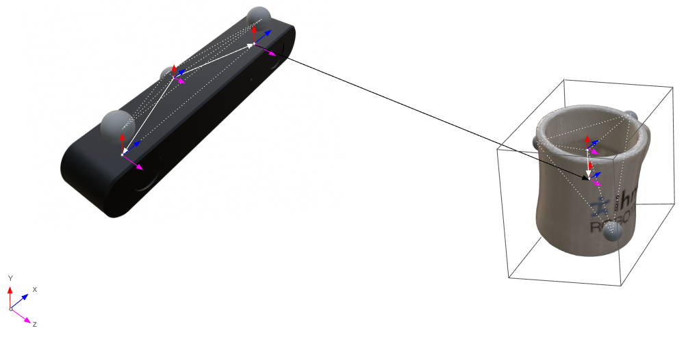
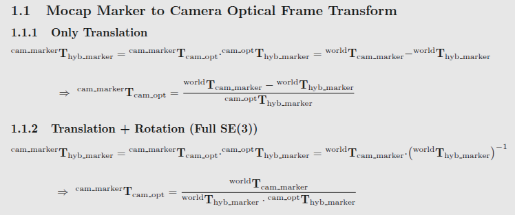
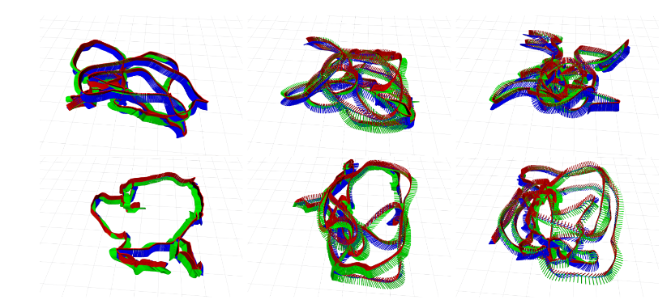
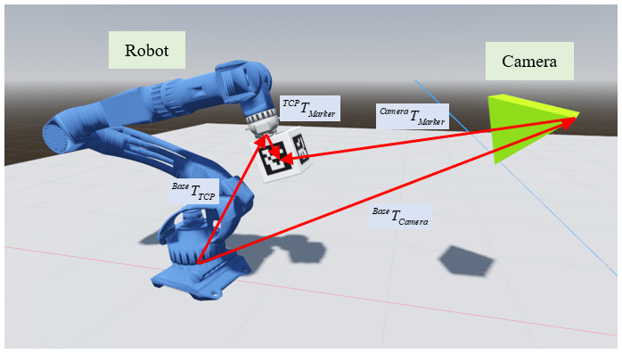
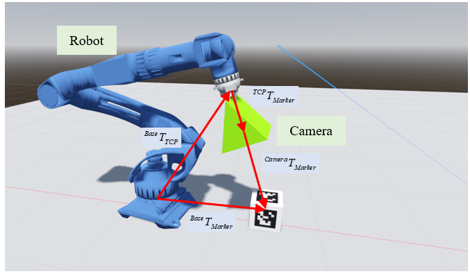

# All About Optitrack and Vicon Motion Capture
This is a tutorial repository for the OptiTrack and Vicon motion capture system.

 

## Start with calibration
- You have to start with the calibration process first since each time you open the system, the cameras may have moved from their previous position. Do the calibration with the wand and set the ground plane accordingly.
- Set the reference orientation of the 3 markers centroid to be (0, 0, 0). Right click on the centroid of the markers --> Reset Pivot.

## Rigid Object Pose Estimation
### Live View the Rigid Body pose
- You can see the marker pose of each rigid body in the info panel in the left tab. On the left panel, you can see the calibration, data, builder, and info.

### Set an offset to the Rigid Body Pose from marker
- You can also set a offset from your marker. See this: https://docs.optitrack.com/motive/rigid-body-tracking

### Marker Placement Rule
- Here is a guideline on how to place a marker: https://docs.optitrack.com/motive/rigid-body-tracking
- Avoid placing the markers in symmetrical shapes such as squares, isosceles, or equilateral triangles. Symmetrical arrangements make asset identification difficult and may cause the Rigid Body assets to flip during capture.

    

### Marker Pose Estimation
- Aligning rigid body pivot point with a replicated 3D Model [[website]](https://docs.optitrack.com/motive/rigid-body-tracking/aligning-rigid-body-pivot-point-with-a-replicated-3d-model)
- Rigid Body Animation [[code]](https://aaronolsen.github.io/tutorials/motion/unification.html)

## Articulated Object Pose Estimation

    
    
    

    
    
    

## Robot Pose Estimation
### Using Opti-Track Motion Capture

    

### Using Vicon Motion Capture

    
    
    

    

### Resources 
- Vicon2GT [[code]](https://github.com/rpng/vicon2gt) [[pdf]](https://github.com/ArghyaChatterjee/All-About-Optitrack-Motion-Capture-Mocap/blob/main/tr_vicon2gt.pdf)

## Manipulator Pose Estimation

    
    

### Resources
- Eye in Hand Toolbox [[code]](https://github.com/liaochikon/Eye-in-hand-toolbox)
- Hand Eye Calibration [[website]](https://campar.in.tum.de/Chair/HandEyeCalibration)

## ROS Resources
- Mocap4ROS2 Project [[code]](https://github.com/MOCAP4ROS2-Project) [[paper]]() [[video]]() 
- Mocap4ROS2 Optitrack [[code]](https://github.com/MOCAP4ROS2-Project/mocap4ros2_optitrack) [[paper]]() [[video]]()
- Mocap4ROS2 Vicon [[code]](https://github.com/MOCAP4ROS2-Project/mocap4ros2_vicon) [[paper]]() [[video]]() 
- Mocap4ROS Vicon [[code]](https://github.com/IntelligentRoboticsLabs/mocap4ros_vicon) [[paper]]() [[video]]()
- Opti-Track Mocap ROS2 [[code]](https://github.com/tud-phi/ros2-mocap_optitrack) [[paper]]() [[video]]()
- NATNet ROS CPP [[code]](https://github.com/ArghyaChatterjee/natnet_ros_cpp) [[paper]]() [[video]]() 

